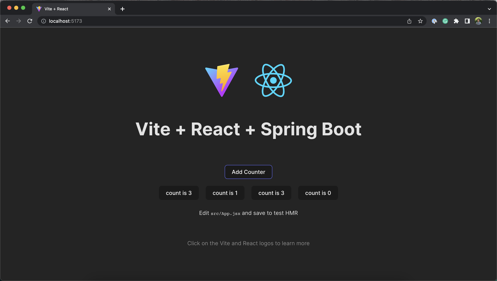

# React with Spring Boot Demo

# Note
I simply took the counter implementaion from the the original template from cerate-react-app and added a few api calls to the backend, which is spring boot.

The root directory contains the main git tree and the `/frontend` and `/backend` folders. 


# Steps
This is assuming that you have Nodejs and JDK of some kind (this project uses 17).

1. Run the spring boot application by either running ```/gradlew bootRun``` in the ```/backend``` directory, or if you have an IDE, go the main method, and click on the run button.
2. Run the react web app by running the `npm run dev` in the `/frontend` directory.
3. Go to the brower, and go to `http://localhost:5173/`.

This will be my boilerplate code for future full stack projects.

#Screenshots

